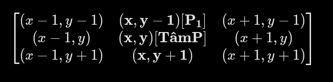

## Trích xuất Minutiae bằng Crossing Number:
* **Định nghĩa Minutiae là gì:** là các đặc trưng cục bộ tvfrênf đường vân tay. Được hiểu như những điểm thay đổi hình học 1 cách đặc biệt.
* **Đặc trưng cục bộ ở đây là gì ?** Đặc trưng cục bộ ở đây gồm 2 loại Minutiae chính là:
    - Termination: Điểm kết thúc của đường vân
    - Bifurcation: Điểm rẽ nhánh của đường vân
* **Đầu vào của Crossing Number:**
    - Sekeleton Image
    - Orientation Field 
    
    Trong đó:
        
    + Skeleton Image: ảnh vân tay được làm mảnh 
    + Orientation Field: bản đồ hướng vân đã được tính trước đó 
* **Ý tưởng thuật toán của Crossing Number:**
    - OpenCV sẽ đọc ảnh với đầu vào đối với ma trận được quy ước như sau: 
    
    - Thuật toán sẽ đi vòng quanh 8 điểm pixel lân cận và đếm số lần chuyển từ 0 -> 1
    - Công thức áp dụng tính cho từng điểm ảnh:
        + CN(P) = 1/2 × Σ |Pi - P(i+1)| 

    - Đầu ra: Ma trận chỉ số CN 

        - **Ý nghĩa sinh học:** 
            + CN = 1: Điểm kết thúc --> Đường vân đang chạy liên tục thì đột ngột và đứt cụt
            + CN = 3: Điểm rẽ nhánh --> Đường vân đang chạy thì bị tách thành 2 nhánh riêng 

            + CN = 0; Điểm cô đọc 1 pixel đen nằm trơ trọi nằm giữa vùng trắng --> hạt nhiễu của ảnh và bị thuật toán bỏ qua

            + CN = 2: Vùng vân bình thường --> Đường vân chạy thẳng hoặc uốn lượn đều đặn. Thuật toán bỏ qua vì không mang tính chất định danh độc bản 

            + CN = 4: Điểm giao chéo: Hai đường vân chạy cắt chéo qua nhau tạo thành chữ X --> trong thực tế trường hợp vân tay điểm giao tréo  này cực kỳ hiếm gặp
- **Kết quả đặc trưng thu được:** sau bước này các đặc trưng chính thu được là minutiae_data = [
  {x, y, type, angle},
  {x, y, type, angle},
  {x, y, type, angle},
  ...
] 

    - **Ý nghĩa các đặc trưng:** 
        + x,y là tọa độ vị trí minutiae
        + type là hình thái điểm: khi so khớp Termination nên so khớp cùng với Termination, Bifurcation nên khớp với Bifurcation
        + angle hướng cục bộ: Dùng để kiểm tra 2 điểm có cùng hướng không khi so khớp

* **Quá trình So khớp:**
    - **Giai đoạn 1:** Biến đổi tọa độ: đưa 2 tập Minutiae về cùng 1 hệ quy chiếu --> để giảm ảnh hưởng của ảnh bị lệch sang trái, phải, lên, xuống

    - **Giai đoạn 2:** tìm cặp Minutiae trùng khớp. 
        + Điều kiện 1: Khoảng cách không gian nhỏ hơn ngưỡng r0 cụ thể r0 trong code hiện tại đang set là 15 (dist_threshold)

        + Điều kiện 2: 
        Độ lệch góc nhỏ hơn ngưỡng là 14 độ (angle_threshold)
         
        + Điều kiện 3: Cùng loại Minutiae
    - **Giai đoạn 3:** Tính điểm tương đồng
    n = số cặp Minutiae trùng khớp 
    
    N1 = Số Minutiae của ảnh Q
    N2 = số Minutiae của ảnh T

